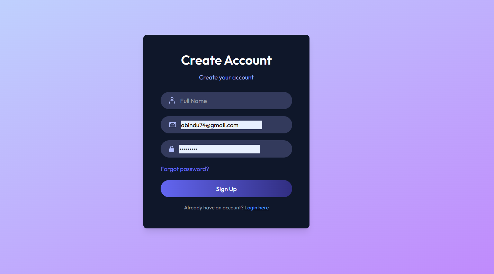
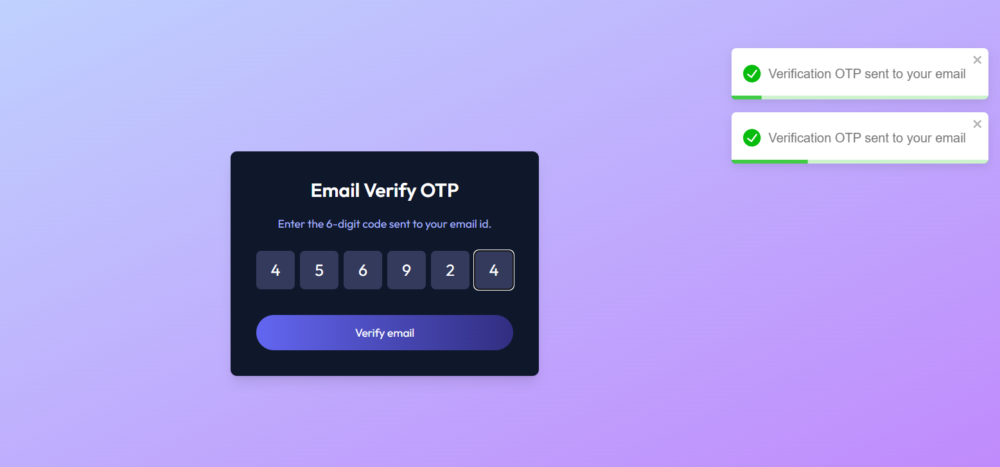
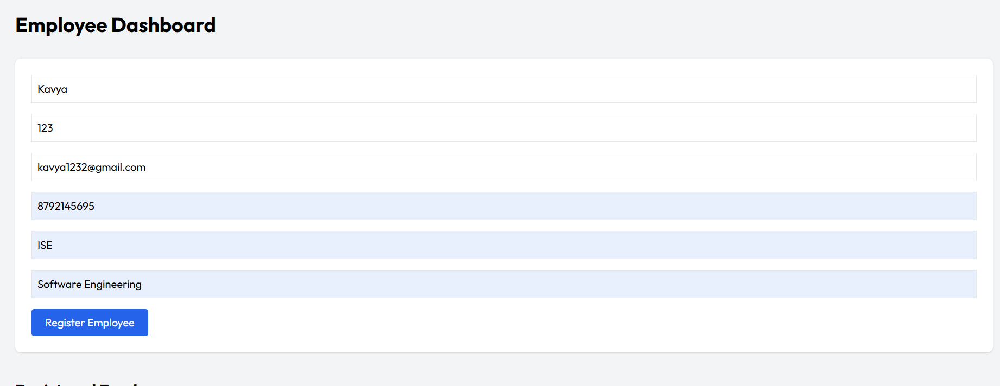
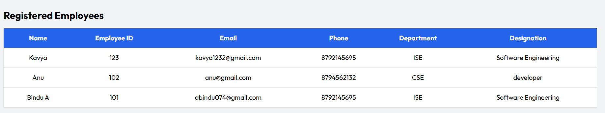

<div align="center">

# Employee Registration & Authentication System 🔐

A full-stack MERN application that provides secure user authentication with Email OTP verification and an Employee Registration Dashboard. Users an sign up, verify their email, log in, register employee details, and view all registered employees.

</div>

<br><hr><br>

## 📌 Project Overview

This project is a complete **Employee Registration and Authentication System** built using the **MERN Stack**.

It provides secure user authentication using **JWT** and **Email OTP Verification**, along with a dashboard where authenticated users can register and manage employee information.

---

# ✨ Features

## 🔐 Authentication

- User Registration
- User Login
- JWT Authentication
- Email Verification using OTP
- Forgot Password
- Password Reset using OTP

---

## 👨‍💼 Employee Management

- Register Employee
- View All Registered Employees
- Store Employee Details in MongoDB
- Employee Dashboard
- Responsive User Interface

Employee Information includes:

- Full Name
- Employee ID
- Email
- Phone Number
- Department
- Designation

---

# 🛠 Tech Stack

## Frontend

- React.js
- Tailwind CSS
- Axios
- React Router DOM
- React Toastify

## Backend

- Node.js
- Express.js
- MongoDB
- Mongoose
- JWT
- Nodemailer
- Cookie Parser
- CORS
- Bcrypt.js

---

# 📂 Project Structure

```
employee-registration-system/
│
├── client/
│   ├── src/
│   │   ├── assets/
│   │   ├── components/
│   │   ├── context/
│   │   ├── pages/
│   │   │   ├── Home.jsx
│   │   │   ├── Login.jsx
│   │   │   ├── Dashboard.jsx
│   │   │   ├── EmailVerify.jsx
│   │   │   └── ResetPassword.jsx
│   │   ├── App.jsx
│   │   └── main.jsx
│   └── package.json
│
├── server/
│   ├── config/
│   ├── controllers/
│   │   ├── authController.js
│   │   ├── userController.js
│   │   └── employeeController.js
│   ├── middleware/
│   ├── models/
│   │   ├── userModel.js
│   │   └── employeeModel.js
│   ├── routes/
│   │   ├── authRoutes.js
│   │   ├── userRoutes.js
│   │   └── employeeRoutes.js
│   ├── server.js
│   └── package.json
│
├── README.md
└── .env.example
```
---

## Screenshots

### Login


### Sign Up



### Email Verification



### Employee Registration



### Employee List




---

# ⚙ Installation

## Clone Repository

```bash
git clone https://github.com/yourusername/employee-registration-system.git
```

## Backend Setup

```bash
cd server
npm install
```

Create a `.env` file

```env
PORT=4000

MONGODB_URI=your_mongodb_connection_string

JWT_SECRET=your_secret_key

SMTP_USER=your_email

SMTP_PASS=your_app_password

SENDER_EMAIL=your_email
```

Run Backend

```bash
npm run server
```

---

## Frontend Setup

```bash
cd client

npm install

npm run dev
```

Frontend runs on

```
http://localhost:5173
```

Backend runs on

```
http://localhost:4000
```

---

# 🚀 Application Flow

```
User Registration
        │
        ▼
Email OTP Verification
        │
        ▼
User Login
        │
        ▼
Employee Dashboard
        │
        ▼
Register Employee
        │
        ▼
Store Employee Details in MongoDB
        │
        ▼
View Registered Employees
```

---

# 📊 Employee Dashboard

The dashboard allows authenticated users to:

- Register new employees
- View all registered employees
- Store employee records in MongoDB
- Manage employee information

---

# 🔒 Security Features

- JWT Authentication
- HTTP Only Cookies
- Password Hashing using Bcrypt
- Email OTP Verification
- Password Reset using OTP
- Protected Backend Routes

---

# 🔮 Future Enhancements

- Edit Employee Details
- Delete Employee
- Search Employee
- Upload Profile Photo
- Resume Upload
- Export Employee Data (PDF/Excel)
- Admin Dashboard
- Role-Based Authentication

---

# 👨‍💻 Developed By

**Bindu A**

---

## ⭐ If you like this project, don't forget to give it a star on GitHub!
